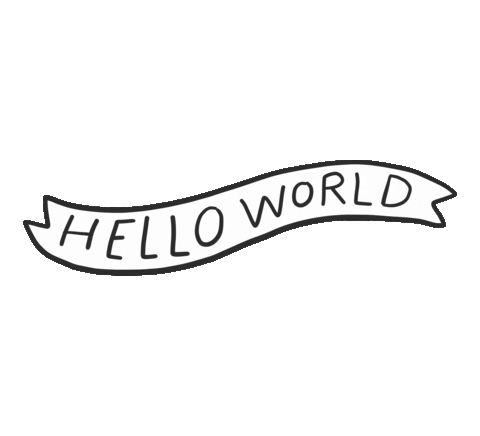
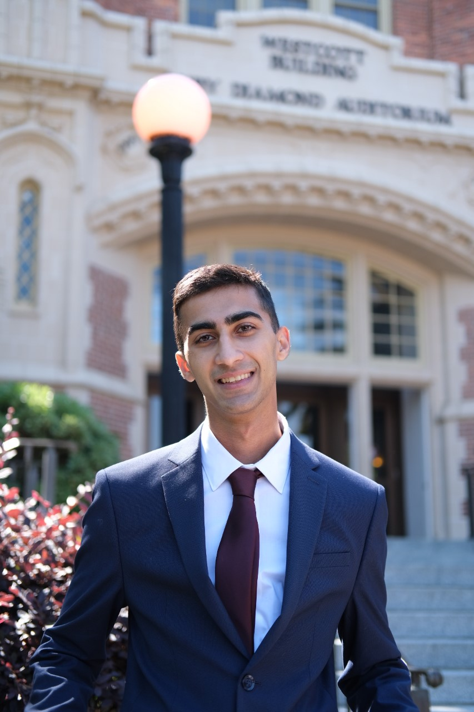
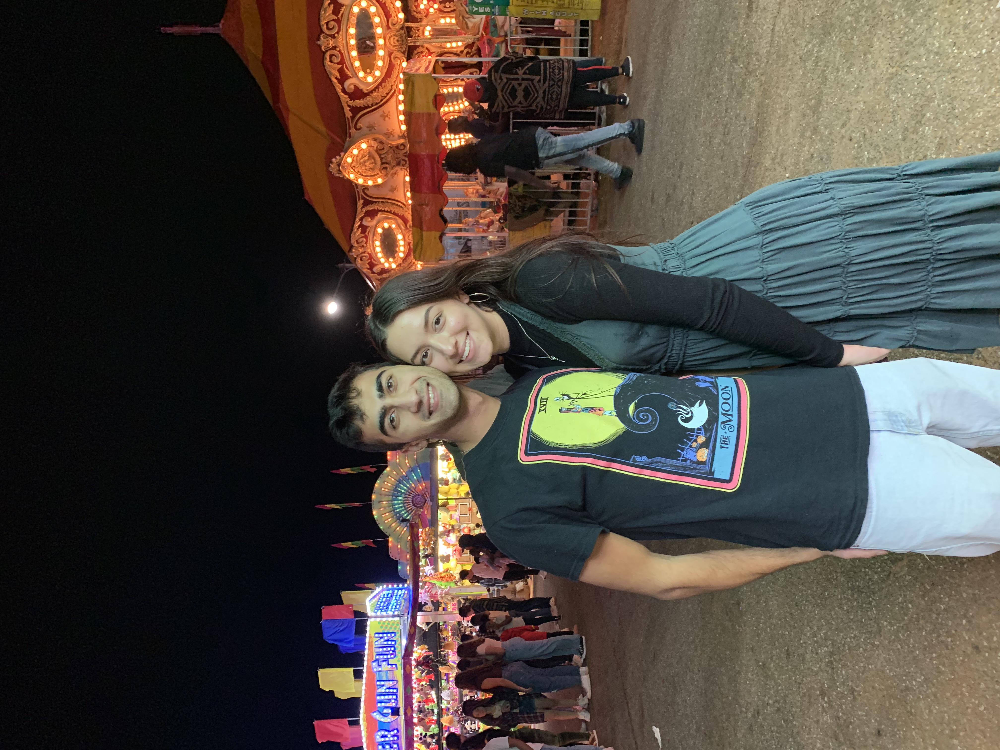

 
    

 

<!-- The sidebar

  <a class="active" href="#home">Home</a>
  <a href="#news">About</a>
  <a href="#contact">Gallery</a>
  <a href="#about">Contact</a>

-->

<!---->

 
    

 

&nbsp;

Hey everyone! I am proud to say that I am a Florida State University alumnus. I have earned my Bachelors of Science in Computer Science along with a Minor in Mathematics.

I'm well-versed in multiple coding languages; including C#, C++, Java, HTML/CSS, and Python. With these languages, I've built a strong background in Object-Oriented Programming and have used multiple tech stacks including Android Studio, MySQL, Django, and Angular/Node.js  My favorite hobbies outside of work would of course have to include spending time with all my loved ones. I love keeping up to date with world news and binging lots of different tv-shows! Feel free to message me at anytime on any platform you find me on. Thanks for taking some of your time to check out my page. That means the world to me!

 Currently working at TCS as a Java Full Stack Software Engineer/E2E Tester with Verizon.

&nbsp;

&nbsp;

[More About Me](about)

[Side Projects](side)

[Contact Me](contact)
